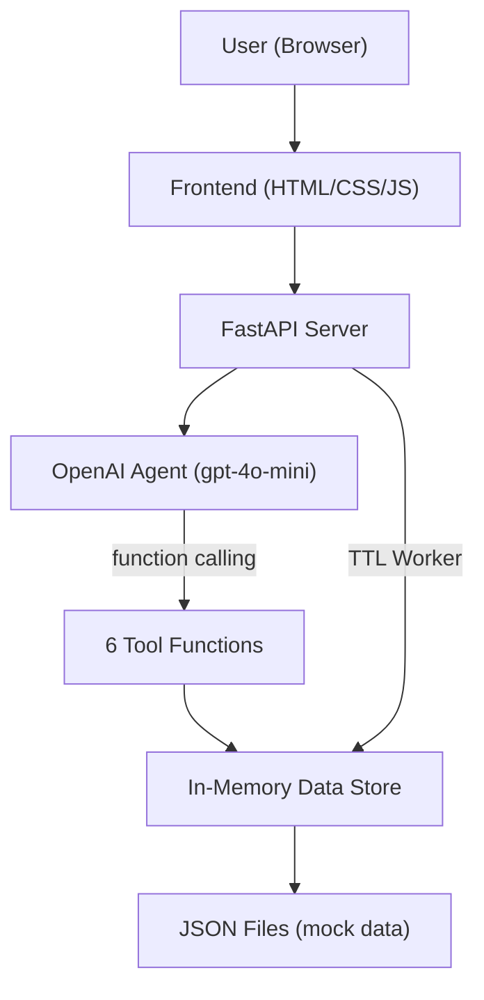

# VinBot — Walkthrough

## Tổng quan

Đã xây dựng hoàn chỉnh AI Agent bảo hành xe máy điện VinFast sử dụng OpenAI LLM API (function calling).


---

## Kiến trúc



---

## Files Created

### Backend ([app/](file:///c:/Users/qv181/OneDrive/Desktop/AI_in_AC/Lab-on-class/Lab6_C401_B3/app/))

| File | Vai trò |
|------|---------|
| [main.py](file:///c:/Users/qv181/OneDrive/Desktop/AI_in_AC/Lab-on-class/Lab6_C401_B3/app/main.py) | FastAPI server, endpoints, TTL worker lifecycle |
| [agent.py](file:///c:/Users/qv181/OneDrive/Desktop/AI_in_AC/Lab-on-class/Lab6_C401_B3/app/agent.py) | OpenAI agent loop, system prompt, tool definitions |
| [tools.py](file:///c:/Users/qv181/OneDrive/Desktop/AI_in_AC/Lab-on-class/Lab6_C401_B3/app/tools.py) | 6 tool functions: warranty, diagnostics, booking |
| [data.py](file:///c:/Users/qv181/OneDrive/Desktop/AI_in_AC/Lab-on-class/Lab6_C401_B3/app/data.py) | Data store, slot state machine, TTL cleanup |

### Data ([data/](file:///c:/Users/qv181/OneDrive/Desktop/AI_in_AC/Lab-on-class/Lab6_C401_B3/data/))

| File | Nội dung |
|------|----------|
| [vehicles.json](file:///c:/Users/qv181/OneDrive/Desktop/AI_in_AC/Lab-on-class/Lab6_C401_B3/data/vehicles.json) | 6 xe mock: Evo200, Klara S2, Feliz S, Vento S, Theon S, Klara Neo |
| [warranty_policy.json](file:///c:/Users/qv181/OneDrive/Desktop/AI_in_AC/Lab-on-class/Lab6_C401_B3/data/warranty_policy.json) | Chính sách bảo hành (xe 6 năm, pin 8 năm), error codes |
| [service_centers.json](file:///c:/Users/qv181/OneDrive/Desktop/AI_in_AC/Lab-on-class/Lab6_C401_B3/data/service_centers.json) | 10 xưởng dịch vụ tại HN, HCM, ĐN, HP, CT |

### Frontend ([static/](file:///c:/Users/qv181/OneDrive/Desktop/AI_in_AC/Lab-on-class/Lab6_C401_B3/static/))

| File | Vai trò |
|------|---------|
| [index.html](file:///c:/Users/qv181/OneDrive/Desktop/AI_in_AC/Lab-on-class/Lab6_C401_B3/static/index.html) | Layout: sidebar + chat area + welcome |
| [style.css](file:///c:/Users/qv181/OneDrive/Desktop/AI_in_AC/Lab-on-class/Lab6_C401_B3/static/style.css) | Dark mode, glassmorphism, VinFast green accent |
| [app.js](file:///c:/Users/qv181/OneDrive/Desktop/AI_in_AC/Lab-on-class/Lab6_C401_B3/static/app.js) | Chat logic, vehicle selection, booking countdown |

---

## Key Features

### 1. Booking Slot Management
- **3 trạng thái**: `AVAILABLE` → `PENDING` → `CONFIRMED`
- **Atomic update**: Thread-safe với `threading.Lock()`
- **TTL 5 phút**: Background worker kiểm tra mỗi 10s, tự trả slot về AVAILABLE khi hết hạn
- **Countdown timer**: UI hiển thị đếm ngược, chuyển đỏ khi < 60s
- **Xác nhận**: User phải click "Xác nhận" trước khi TTL hết

### 2. AI Agent (6 Tools)
- `lookup_warranty_status` — Tra cứu bảo hành
- `explain_warranty_policy` — Giải thích chính sách
- `diagnose_telemetry` — Chẩn đoán sơ bộ (SOH, temp, lốp, mã lỗi)
- `find_nearest_service_center` — Tìm xưởng gần nhất
- `get_available_time_slots` — Xem slot trống
- `create_appointment` — Đặt lịch (PENDING + TTL)

### 3. Guardrails
- ❌ Không cam kết tài chính, quà tặng, đền bù, đổi xe
- ❌ Không xác nhận miễn phí cho lỗi vật lý
- ❌ Không chốt giờ phục vụ như cam kết cứng
- ✅ Fallback sang hotline 1900 23 23 89

---

## Cách chạy

```bash
# 1. Tạo file .env
cp .env.example .env
# Sửa OPENAI_API_KEY trong .env

# 2. Cài dependencies
pip install -r requirements.txt

# 3. Chạy server
python -m uvicorn app.main:app --host 127.0.0.1 --port 8000

# 4. Mở browser
# http://127.0.0.1:8000
```

## Verification
- ✅ Server khởi động thành công
- ✅ API `/api/vehicles` trả về 200 OK
- ✅ API `/api/chat` trả về 200 OK (function calling hoạt động)
- ✅ UI render đúng: dark mode, vehicle list, welcome screen, quick actions
